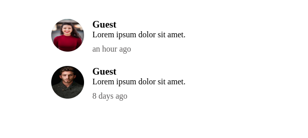

# vuejs-timeago 
[](https://travis-ci.com/abakermi/vuejs-timeago ) [](https://badge.fury.io/js/vuejs-timeago )


A simple time-ago component for vuejs


<br>
## Installation

### Install via CDN
```html
<script src="https://unpkg.com/vue"></script>
<script src="https://unpkg.com/vuejs-timeago @0.0.1"></script>

<script>
  Vue.use(VueTimeAgo.default)
</script>
```

### Install via NPM
```sh
$ npm install vuejs-timeago  --save
```

#### Register as Component
```js
import Vue from 'vue'
import VueTimeAgo from 'vuejs-timeago '
export default {
  name: 'App',
  components: {
    VueTimeAgo
  }
}
```

#### Register as Plugin
```js
import Vue from 'vue'
import VueTimeAgo from 'vuejs-timeago '
Vue.use(VueTimeAgo)
```

## Usage

```js
<template>
 <vuejs-timeago  date="2020-08-07T11:32:01.592Z" format="DD-MM-YYYY" iso="true" > 
   <slot >
     ago
     </slot>
 </vuejs-timeago >
</template>
<script>
import VFeedYoutube from 'vue-feeds-youtube'
export default {
  name: 'App',
  components: {
    VFeedYoutube
  }
}
</script>
```

## Props
|Props|Description|Type|Required|
|-----|-----------|----|--------|
|date|date string to calculate time from |String|true
|format|optional date format  |String|true
|iso|set format to iso |String|false


## License

vuejs-timeago  is open-sourced software licensed under the [MIT license](http://opensource.org/licenses/MIT)